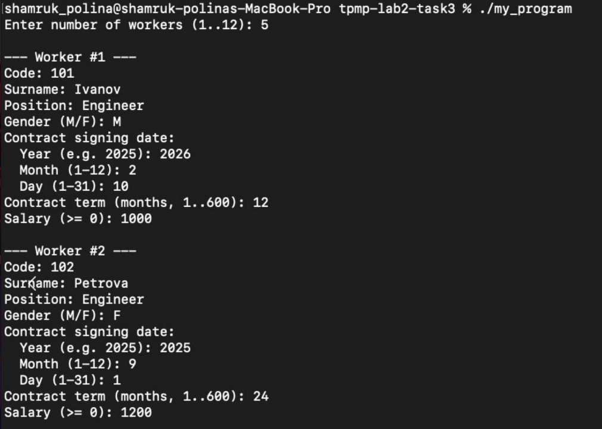

# Протокол тестирования  
Задание 3. Использование структур  
Вариант 19  
Студент: Шамрук Полина Александровна  

---

## Условия тестирования

Программа собирается командой:

- `make`

Запуск:

- `./my_program`

Данные вводятся с клавиатуры (создание массива до 12 работников), затем вводится текущая дата `today` и должность для расчёта среднего срока контракта.

---

## Таблица результатов

| № п/п | Входные данные | Ожидаемые выходные данные | Действительные выходные данные | Тест пройден |
|------:|----------------|---------------------------|---------------------------------|:-----------:|
| 1 | **n=5 работников**, затем `today = 2026-02-27`, должность для среднего: `Engineer`.  1) code=101, Ivanov, Engineer, M, sign=2026-02-10, term=12, salary=1000 2) code=102, Petrova, Engineer, F, sign=2025-09-01, term=24, salary=1200 3) code=101, Ivanov, Engineer, M, sign=2024-01-01, term=18, salary=1100 4) code=103, Sidorov, Manager, M, sign=2023-02-01, term=6, salary=900 5) code=104, Smirnova, Engineer, F, sign=2026-02-26, term=18, salary=1300 | **Контракт < 1 года:** работники с sign_date в диапазоне `<365` дней до today: Ivanov(code=101, sign=2026-02-10), Petrova(code=102), Smirnova(code=104).  **Дважды заключали контракт:** code=101 (Ivanov) — встречается 2 раза → выводится один раз.  **Средний срок для Engineer:** (12 + 24 + 18 + 18) / 4 = **18.00 months**.  **Количество по полу:** M=3, F=2 | Совпадает с ожидаемым: выводятся работники <1 года, повтор по code=101, средний Engineer=18.00, пол M=3 F=2 | Да |
| 2 | **n=2 работника**, затем `today = 2026-02-27`, должность: `Designer`.  1) code=201, Volkova, Engineer, F, sign=2025-01-01, term=12, salary=1000 2) code=202, Orlov, Manager, M, sign=2024-01-01, term=6, salary=900 | **Контракт < 1 года:** нет (оба подписаны более года назад).  **Дважды заключали контракт:** нет (коды уникальны).  **Средний срок для Designer:** должность отсутствует → сообщение `No workers with position 'Designer'`.  **Пол:** M=1 F=1 | Совпадает с ожидаемым: нет работников <1 года, нет повторов, средний по Designer отсутствует, M=1 F=1 | Да |
| 3 | **Граничный случай "< 1 года":** n=1, затем `today = 2026-02-27`.  1) code=301, Testov, Engineer, M, sign=2025-02-27, term=12, salary=1000 | Разница ровно 365 дней → условие `< 365` не выполняется → работник **не должен** попасть в список `< 1 year ago`.  Остальные пункты: повторов нет; средний по Engineer=12.00; пол M=1 F=0 | Совпадает с ожидаемым: работник не выводится в блоке `< 1 year ago`, средний = 12.00, M=1 F=0 | Да |

---

## Скриншоты выполнения

> Скриншоты расположены в папке `docs/images/`.

### Тест 1 (основной набор данных)

### Тест 2 (нет подходящих результатов)

### Тест 3 (граничное значение 365 дней)

---

## Вывод

Все тесты выполнены успешно.  
Программа корректно обрабатывает ввод массива работников, выводит работников с контрактом менее года назад, определяет работников с повторным заключением контракта (по коду), вычисляет средний срок контракта для заданной должности и подсчитывает количество работников мужского и женского пола.
